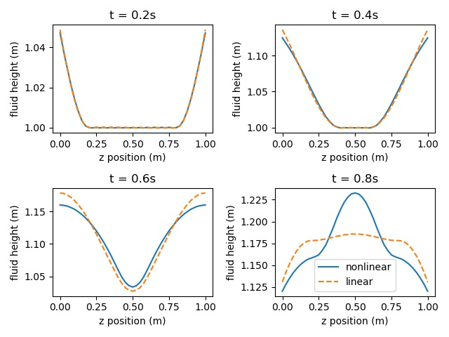
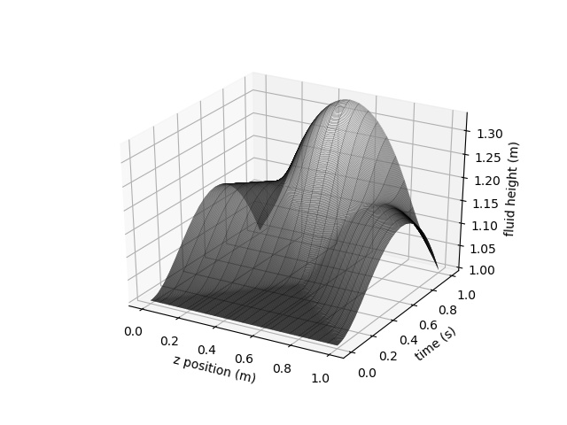
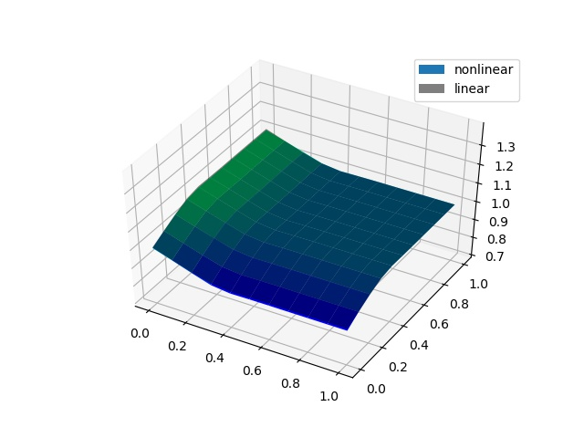
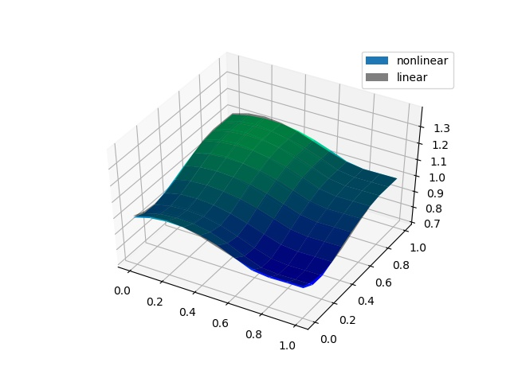
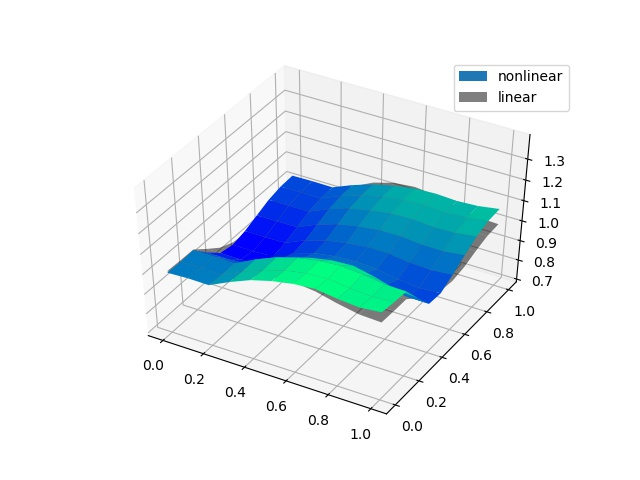
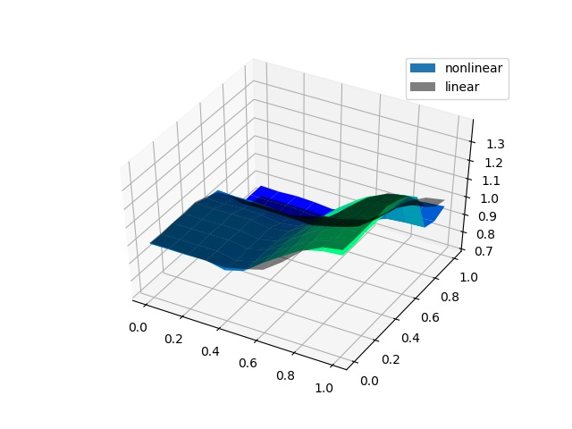

[](https://travis-ci.org/flavioluiz/PFEM-article-supplementary-material)

# A Partitioned Finite Element Method for power-preserving discretization of open systems of conservation laws - Supplementary material
Authors: F.L. Cardoso-Ribeiro, D. Matignon, L. Lefèvre.

This archive contains supplementary material for the paper "A Partitioned Finite Element Method for power-preserving discretization of open systems of conservation laws", containing the source codes for the numerial results presented in the paper. An arXiv pre-print version of the paper is available [here](https://arxiv.org/abs/1906.05965).

The following codes are provided:

* `codes/simulation1D_small.jl`: small amplitudes (linear) 1D simulation

* `codes/simulation1D_large.jl`: large amplitudes (nonlinear) 1D simulation

* `codes/simulation1D_analytical_gradient`: large amplitudes 1D simulation, but using an analytical nonlinear Hamiltonian gradient expression

* `codes/simulation2D.jl`: large amplitudes (nonlinear) 2D simulation

* `codes/convergence1D.jl`: convergence analysis of the 1D linear case

* `codes/convergence2D.m`: convergence analysis of the 2D linear case

## Installing
Before running the codes, you should install the [PortHamiltonian.jl](https://github.com/flavioluiz/PortHamiltonian.jl) package for Julia (it should work on v0.7):

```julia
julia> Pkg.clone("git://github.com/flavioluiz/PortHamiltonian.jl")
```

## 1D nonlinear simulations
Two codes are provided for 1D simulations using PFEM, one using small amplitudes of boundary excitation, and the other with large amplitudes. It suffices to run the Julia file, by using:
```julia
julia> include("simulation1D_large.jl")
```
In the case of large amplitudes, the following results should be obtained (snapshots of the height at different times):






Obs.: In the simulations obtained with the file `simulation1D_large.jl`, the gradient of the Hamiltonian is obtaines using an automatic differentiation tool ([ForwardDiff](https://www.juliadiff.org/ForwardDiff.jl/)). On the other hand, the file `simulation1D_analytical_gradient.jl`, this nonlinear gradient is obtained analytically, as explained in the paper.

## 2D nonlinear simulations
One code is provided for 2D simulations using PFEM (`simulation2D.jl`). Changing the amplitude of the oscillation is straightforward (it suffices to change the variable "amp").

Example of results obtained (snapshots of simulation):

  |  
:-------------------------:|:-------------------------:
  | 


## Acknowledgements
This  work  has  been  performed  in  the  frame  of  the  Collaborative  Research  DFG  and  ANR  project  INFIDHEM,  entitled "Interconnected of Infinite-Dimensional systems for Heterogeneous Media",  nº ANR-16-CE92-0028.  Further  information  is  available  [here](http://websites.isae-supaero.fr/infidhem/the-project).
